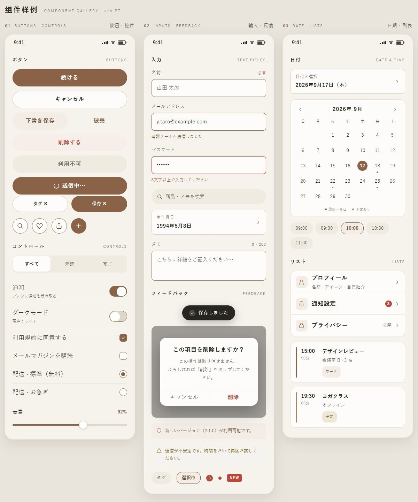
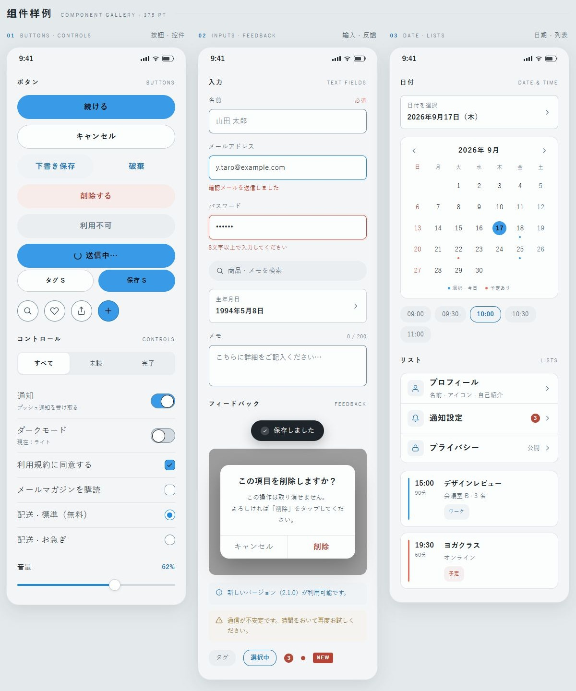

# App UI · 日式简约式样与 Skill

一套可复用的 iPhone UI 设计规范：包含 **设计式样、可浏览的 HTML 样张、语义颜色 Token，以及维护这些内容的 AI skill**。适合先选定界面风格，再交给设计者或开发者接入具体 App。

**[在线浏览 UI](https://dingding-abc.github.io/app-ui/)** · [式样 Skill](skill/SKILL.md) · [式样内容说明](docs/style-guide.md) · [下载完整离线包](dist/jp-min-ui-kit-5.1.zip)

> 本项目是设计规范与 HTML 演示，不是可安装的 iOS App。可操作组件使用本地演示数据，没有后端或真实保存服务。

## 先看两种风格

首页精选「余白」与「晴日」，用同一组按钮、输入、日期和列表组件展示两种配色。仓库仍保留全部 7 套主题，每套包含浅色、深色及各自增强对比度（HC）模式。

### 余白 · YOHAKU

暖纸底色 `#F6F3ED`、焦茶主色 `#8A6248`，以留白、细线和柔和卡片建立安静的层级。适合手帐、笔记、阅读和生活方式类 App。



[查看余白基础样张](https://dingding-abc.github.io/app-ui/a-yohaku.html) · [深色与扩展组件](https://dingding-abc.github.io/app-ui/a-yohaku-ext.html)

### 晴日 · SUNNY DAY

蓝色 `#399BE8` 用于主要操作，珊瑚色 `#F26B5B` 与暖黄 `#F4C84A` 用于分类和辅助层级，整体更明快。可用于日程、习惯、活动和轻量效率工具。功能文字使用单独计算的可读颜色，不直接照搬浅色品牌填充。



[查看晴日基础样张](https://dingding-abc.github.io/app-ui/theme-sunny-day.html) · [深色与扩展组件](https://dingding-abc.github.io/app-ui/theme-sunny-day-ext.html)

两张图片均截自仓库生成的浅色 HTML 页面，属于外观预览。交互入口在各主题页面下方的「可操作组件」区域；截图方法与范围见[预览记录](docs/previews/README.md)。

## 仓库里有什么

| 内容 | 入口 | 用途 |
| --- | --- | --- |
| 设计规范 | [standards.html](standards.html) | 字体、间距、语义色、按钮形状、交互与验收要求 |
| 主题样张 | [index.html](index.html) | 余白、藍染、若竹、紫硝子、青磁、桜色、晴日 |
| 组件 | [components.html](components.html) | 按钮、输入、列表、日历、Sheet、Alert、空态、引导、图表和本地交互演示 |
| 时间选择 / Widget | 各主题页与[式样说明](docs/style-guide.md) | 时/分双列滚轮、桌面与锁屏小组件外观规范 |
| 图标与尺寸 | [icons.html](icons.html)、[devices.html](devices.html)、[adaptive.html](adaptive.html) | 169 枚线性图标、尺寸样张和可调容器压力演示 |
| 颜色与原生接入 | [design-tokens.json](design-tokens.json)、[接入说明](docs/native-consumption.md)、[native/](native/) | 四模式颜色、Token 适配器和 React Native 源码示例 |
| 式样 Skill | [skill/SKILL.md](skill/SKILL.md) | 复用现有主题、生成新色系、修改规范与执行验证 |

GitHub 文件页只展示 HTML 源码；查看实际页面请使用上方在线浏览链接，或下载后用浏览器打开 `index.html`。

## 在本地浏览和构建

```sh
git clone https://github.com/dingding-abc/app-ui.git
cd app-ui
```

已有 HTML 可直接打开，无需安装依赖。需要修改或重建时，使用 [`.python-version`](.python-version) 指定的 **Python 3.12.14**；构建仅依赖标准库。Windows 使用 Windows Python，WSL 使用对应发行版内的 Python。

```sh
python skill/scripts/rebuild.py
python skill/scripts/validate.py
python skill/scripts/test_system.py
python skill/scripts/package_release.py
python skill/scripts/test_release.py
```

也可以在仓库根目录运行 `python -m http.server 8000 --bind 127.0.0.1`，再访问 [本地预览](http://127.0.0.1:8000/)。额外的 JavaScript 状态及语法检查需要 Node.js，本次验证使用 24.19.0，完整命令见 [PROJECT.md](PROJECT.md)。

## 怎样使用式样 Skill

这是**仓库内 skill**，需要整个项目。它的注册名是 `jp-min-ui-build`，入口位于 `skill/SKILL.md`；单独复制 `skill/` 无法获得完整生成器。把仓库交给支持读取项目文件的 AI 编程助手，并明确引用这个入口即可，不要求安装全局 skill。

示例请求：

```text
请阅读当前仓库的 AGENTS.md 和 skill/SKILL.md，使用余白风格设计一个笔记 App。
沿用语义色、字号、按钮形状与交互规范，说明哪些现有组件可以复用。
```

```text
请按 skill/SKILL.md 新增雾蓝色主题，ID 为 mist-blue，主色 #6C8FA8，
用于阅读 App。保留现有主题，生成四模式样张并运行构建和验收。
```

也可直接执行 skill 中的 `create_theme.py --dry-run` 预览配置，再登记主题、重建和验证。修改应从 Python 生成源或 `themes.json` 入手，不直接编辑产出的 HTML 和 Token JSON。具体来源见 [PROJECT.md](PROJECT.md)。

## 验证与许可

本次实际结果见 [ACCEPTANCE_REPORT.md](ACCEPTANCE_REPORT.md)；静态结果见 [acceptance-results.json](acceptance-results.json)。浏览器预览不等于原生 iOS、VoiceOver、系统 Dynamic Type 或真机触控验收。`native/` 是接入示例，WidgetKit 是外观规范，均需在实际 App 工程中实现并验证。

采用 [MIT License](LICENSE)。项目不打包 Apple 字体或 SF Symbols；系统字体名称和平台能力说明不代表这些资源随 MIT 授权。旧归档、日志和缓存保留在原工作区，不纳入此仓库。
