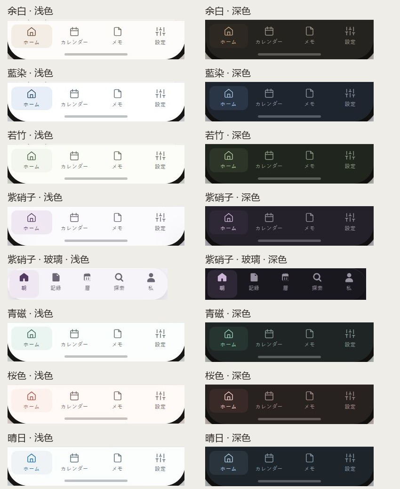

# UI 预览记录

## 2026-10-10 UI一致性修订（当前图片）

以下既有图片路径已从最终生成页重新截图：7主题14全页、7组件预览、2顶部提示及导航对照图；不是沿用此前像素。默认浏览器1280×720，全页宽1265px，高度随页面；组件和提示按当前元素边界裁切，提示裁图宽1200px。导航对照为中文主题名、浅/深两列；紫硝子玻璃另行显示，无裁切。下文保留早先采样历史，旧几何数字不作为当前证据。

本轮另保存[320px容器/大字样张](ui-consistency-stress.jpg)、[表单成功反馈](ui-consistency-form.jpg)及[390px正式页面](ui-consistency-narrow.jpg)。116压力场景、784颜色绑定及14窄屏页的范围见[本轮验证](../ui-consistency-check.md)；静态截图不代表原生iOS或动态提示生命周期通过。

## 2026-10-10 全部主题图片更新（此前记录）

全部 7 套主题均从重建后的本地 HTML 实际截图，包含 14 张基础／扩展完整页和 7 张组件＋整屏导航预览。原 `yohaku.jpg`、`sunny-day.jpg` 已替换，README 和总览继续使用相同路径。完整页包含页面现有组件、顶部轻提示、WidgetKit、时间滚轮与增强对比度样张；紫硝子还包含玻璃变体。

| 主题 | 组件与导航 | 基础完整页 | 深色与扩展完整页 |
| --- | --- | --- | --- |
| 余白 | [预览](yohaku.jpg) | [完整图片](yohaku-full.jpg) | [完整图片](yohaku-ext-full.jpg) |
| 藍染 | [预览](aizome.jpg) | [完整图片](aizome-full.jpg) | [完整图片](aizome-ext-full.jpg) |
| 若竹 | [预览](wakatake.jpg) | [完整图片](wakatake-full.jpg) | [完整图片](wakatake-ext-full.jpg) |
| 紫硝子 | [预览](murasaki.jpg) | [完整图片](murasaki-full.jpg) | [完整图片](murasaki-ext-full.jpg) |
| 青磁 | [预览](seiji.jpg) | [完整图片](seiji-full.jpg) | [完整图片](seiji-ext-full.jpg) |
| 桜色 | [预览](sakura.jpg) | [完整图片](sakura-full.jpg) | [完整图片](sakura-ext-full.jpg) |
| 晴日 | [预览](sunny-day.jpg) | [完整图片](sunny-day-full.jpg) | [完整图片](sunny-day-ext-full.jpg) |

截图环境：浏览器默认视口 1280×720，默认字号；完整图片宽 1265px（不含滚动条），高度按实际页面。组件预览从“组件样例”标题上方 12px 截至“顶部轻提示”标题上方 20px，横向范围 32–1232px，保留整屏示例及底部导航。每次更新均应读取当前元素位置，不沿用旧裁切坐标。导航对照图仅从实际完整截图裁切拼接并添加主题标签，未修改组件颜色或形状。

浏览器读取全部 14 页导航样式，共 18 个选中项（含紫硝子玻璃变体），均有主题底色、主题前景及 12px 圆角；另逐一查看 7 主题浅深导航对照图。截图属于 HTML 外观证据，不代表所有组件交互、HC 导航、系统大字号或原生 iOS 验收。

## 2026-10-10 顶部轻提示静态样张（此前记录）

最新更新：两张顶部提示截图已替换为主题配色、顶部居中的独立悬浮版本，底色取 `accent_soft`、前景取 `accent_deep`；从完整截图裁取新增区域（1000×650）。胶囊位于示意顶部安全区下沿再向下 8px，摄像头轮廓用于直观看到避让关系；品牌导航行固定为 44px，有无提示均保持同一布局。浏览器计算样式核对覆盖 7 主题四模式共 28 个提示，普通对比度最低约 4.61:1，HC 最低约 7.00:1，图标与文字同色。完整停留时长已改为 1.5 秒，之后约 200ms 淡出；动态时长只写入规范，静态截图仍保持提示可见。

`top-feedback-light.jpg`、`top-feedback-dark.jpg` 分别来自重建后的 `a-yohaku.html#top-feedback` 和 `a-yohaku-ext.html#top-feedback`，从浏览器默认 1280×720 视口的完整截图裁切。每张包含普通与增强对比度样张，提示持续可见，无计时器或消失动画。另在 390×844 视口核对浅色样张，提示卡片宽 343px，内容无内部横向溢出。本轮另检查 28 个提示的几何：水平中心偏差为 0，距摄像头下沿 22px；390×844 下提示仍居中、不超出容器，保持 absolute 和 pointer-events:none。该检查仅针对新增区域，未验证原生 App、VoiceOver 或系统大字体。

## 2026-10-08 交互规范预览

`interaction-standard.jpg` 来自重建后的 `standards.html#picker-presentation`，默认桌面视口（1280×720），显示新增标题、说明和表格；不是原生弹层截图。另以 390×844 检查新增区域换行，修复规范页自身的 box-sizing 后，页面内容宽度 375px（含系统滚动条的视口 390px），无整页横向溢出。原有两张主题画板的内容和样式本次未改，保留 2026-10-07 截图。

