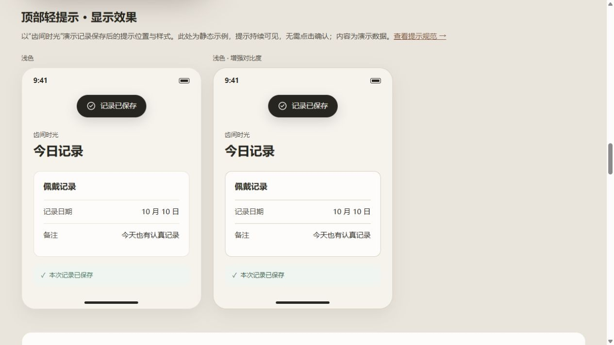
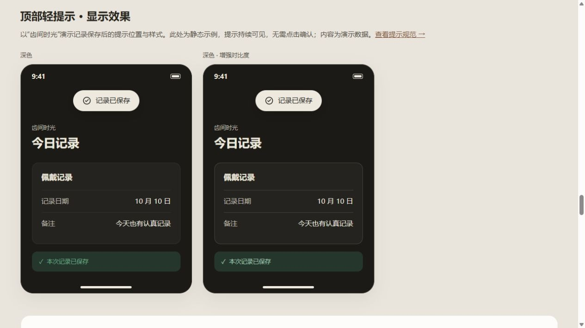
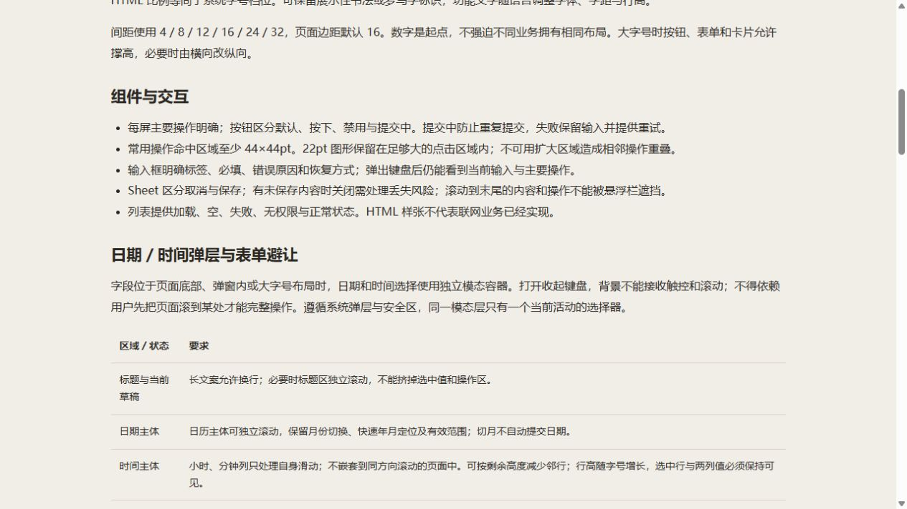

# UI 预览记录

## 2026-10-10 顶部轻提示静态样张

`top-feedback-light.jpg`、`top-feedback-dark.jpg` 分别来自重建后的 `a-yohaku.html#top-feedback` 和 `a-yohaku-ext.html#top-feedback`，为浏览器默认视口截图。每张包含普通与增强对比度样张，提示持续可见，无计时器或消失动画。另在 390×844 视口核对浅色样张，提示卡片宽 343px，内容无内部横向溢出。该检查仅针对新增区域，未验证原生 App、VoiceOver 或系统大字体。

两张图片均于 2026-10-07 从本仓库重建后的 HTML 页面截取，浏览器默认视口 1280 × 720，浅色、默认字号。它们用于 GitHub README 与网页总览的式样介绍，不是生成插画。

| 文件 | 源页面 | 截图内容 |
| --- | --- | --- |
| `yohaku.jpg` | `a-yohaku.html` | 按钮/控件、输入/反馈、日期/列表 |
| `sunny-day.jpg` | `theme-sunny-day.html` | 同一组组件，采用晴日配色 |

更新方法：从仓库根目录启动本地 HTTP 服务，打开主题页，等字体和布局稳定后截取整页，再裁出「组件样例」标题和前三列画板。此次裁切结果为 1200 × 1440；余白整页裁切矩形为 `(32,749)-(1232,2189)`，晴日为 `(32,722)-(1232,2162)`。页面布局改变后应根据实际位置重新选区，不直接复用旧坐标。没有修改画板配色、文字或组件内容。

这两张截图只验证所示浅色画板的呈现。深色/HC 的颜色静态检查见验收结果，交互与原生平台验证另行记录。

## 2026-10-08 交互规范预览

`interaction-standard.jpg` 来自重建后的 `standards.html#picker-presentation`，默认桌面视口（1280×720），显示新增标题、说明和表格；不是原生弹层截图。另以 390×844 检查新增区域换行，修复规范页自身的 box-sizing 后，页面内容宽度 375px（含系统滚动条的视口 390px），无整页横向溢出。原有两张主题画板的内容和样式本次未改，保留 2026-10-07 截图。

